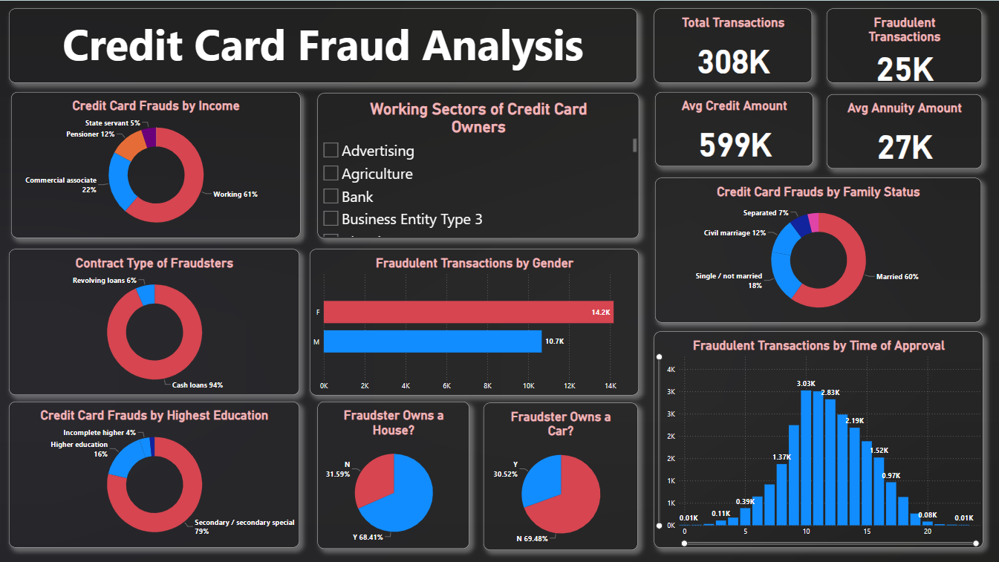

# Credit Card Fraud Analysis with PowerBI Visualization

## Overview

This repository contains an implementation of credit card fraud detection using Random Forest and Decision Trees. Credit card fraud is a significant issue in the financial industry, and machine learning algorithms offer effective solutions for detecting fraudulent transactions.

## How It Works

1. **Data Preprocessing**: The dataset containing credit card transactions is preprocessed to handle missing values, normalize features, and balance the classes if necessary.

2. **Model Training**: Both Random Forest and Decision Tree classifiers are trained on the preprocessed data. Random Forest is an ensemble learning method that builds multiple decision trees and merges their outputs to improve accuracy and reduce overfitting. Decision Trees are simple yet powerful classifiers that work by recursively partitioning the feature space.

3. **Model Evaluation**: The trained models are evaluated using performance metrics such as accuracy, precision, recall, and F1-score. These metrics provide insights into the model's ability to correctly classify fraudulent and non-fraudulent transactions.

4. **Deployment**: Once trained and evaluated, the best-performing model can be deployed in a real-world scenario to detect credit card fraud in real-time.

## PowerBI Dashboard: 

Link to the PowerBi live Dashboard: https://app.powerbi.com/view?r=eyJrIjoiYjk0Mjg4NGEtZDc5Mi00MzcyLWJmMDEtNzQ3YzU2MzM4ZDQxIiwidCI6Ijg0YzMxY2EwLWFjM2ItNGVhZS1hZDExLTUxOWQ4MDIzM2U2ZiIsImMiOjZ9
